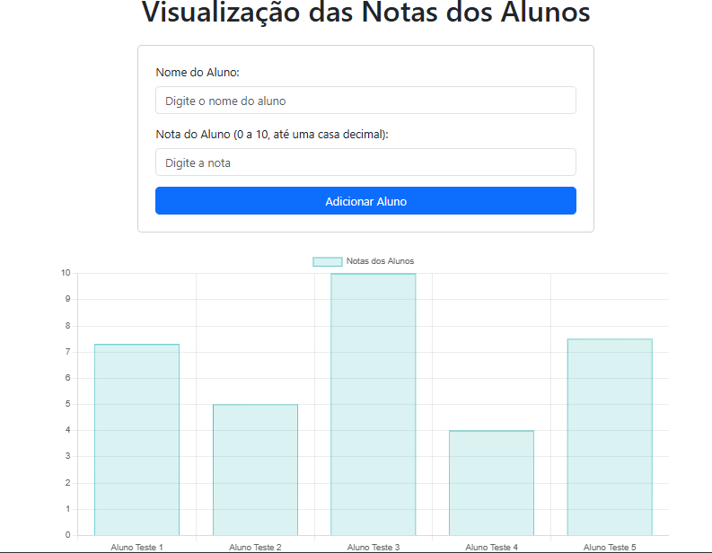

# projeto-visualizacao-notas

## Este projeto visa:

- Receber dados sobre as notas de uma turma de alunos.
- Cada nota deve ser representada no gráfico de barras.
- O gráfico de barras deve mostrar as notas no eixo y e os nomes dos alunos no eixo x.
- O usuário deve ser capaz de visualizar o gráfico e analisar o desempenho dos alunos.

